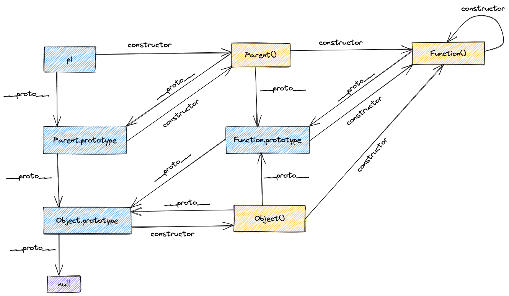

# ES6

### let const var 的区别

- var 会作用域提升。全局或者局部作用域中使用 var 变量，都会被提升到该作用域的最顶部。var 在全局作用域中声明的变量会挂载到 window 对象上（创建一个新的全局变量作为全局对象的属性）。
- let 没有变量提升，只作用于当前作用域；不能重复声明；
- const 声明常量，一旦定义就不能修改；必须初始化值；const 不能修改指针，可以修改值，例如修改一个对象中的某个属性值；
- 总结来说，let 和 const 的特点
  - 不会被提升
  - 重复声明报错
  - 不绑定全局作用域
- 暂时性死区：JS 引擎在扫描代码时发现变量声明时，遇到 var 会将他们提升到当前作用域的顶端，如果遇到 let 和 const 会将声明放进 TDZ，如果访问 TDZ 中的变量就会抛出错误，只有执行完 TDZ 的变量后才会将它移出，这种机制只在当前作用域生效。

#### 什么是块级作用域

- 块级作用域存在于 函数内部 块中（字符{ 和 }之间）
- if 不构成块级作用域

#### 暂时性死区的原理是什么？为什么提前访问 let 定义的变量会抛错？讲讲其中的过程？

- 程序控制流程在新的作用域进行实例化的时候，此作用域中 let/const 会先被创建出来，但是未进行词法绑定；所以不能被访问
- 在变量创建到词法绑定的这个过程被称作暂时性死区

#### 循环中的块级作用域

- let 在循环在的声明内部的行为是标准中单独定义的
- 使用`for(let i = 0; i < 3; i++)`中，会在圆括号内建立一个隐藏的作用域

### const 对象的属性可以修改吗

- 可以，const 只是不允许修改值的绑定，值是可以修改的

### 箭头函数和普通函数的区别

- this 指向
  - 箭头函数没有 prototype，所以箭头函数本身没有 this
  - 箭头函数的 this 指向它定义时外层的第一个普通函数；如果外层没有普通函数，严格模式和非严格模式都指向 window；
    - 普通函数的默认绑定规则：非严格模式下指向 window，严格模式下指向 undefined
  - 箭头函数本身的 this 不能改变，但可以改变它继承的对象的 this 指向；
- arguments
  - 箭头函数的 this 指向全局，使用 arguments 会报错；指向普通函数时，argumens 继承于该普通函数
- new
  - 箭头函数使用 new 会报错，因为箭头函数没有 construtor;
  - 箭头函数也不支持 new.target
- 其他
  - 箭头参数不支持重命名，普通函数可以重名名
  - 更优雅

### 如果 new 一个箭头函数会怎么样

- 会报错，因为箭头函数没有 construtor

### 箭头函数的 this 指向哪里

- 箭头函数的 this 指向定义时所在的外层第一个普通函数，跟使用位置没有关系。
- 被继承的普通函数的 this 指向改变，箭头函数的 this 指向会跟着改变

#### 怎么修改箭头函数 this 的指向

- 修改被继承的普通函数的 this 指向

```javascript
bar.call(barObj);
```

### 如何获取箭头函数的不定量参数

- rest 参数（优点如下）
  - 箭头函数和普通函数都可以使用
  - 更加灵活，接收参数的数量完全自定义
  - 可读性更好
  - rest 是真正的数组，可以使用数组 API
  - ps：函数的 length 属性不包括 rest 参数

### 扩展运算符的作用及使用场景

- 作用：展开可迭代的对象

- 拷贝数组对象
  - 严格来讲，扩展运算符不执行深拷贝；对于一维数组是深拷贝；
- 合并数组
- 参数传递
- 与 set 一起去重
- 字符串转字符数组
- nodeList 转数组
- 解构变量

### proxy 可以实现什么功能

- 自定义对象的操作
- 常用于数据的监听，比如对象的 set、get 操作

### 对对象和数组的结构的理解

- 数组：以元素位置作为匹配条件
- 对象：以属性名称为匹配条件

### 如何提取高度嵌套的对象里的指定属性

```javascript
const school = {
  classes: {
    stu: {
      name: "bob",
      age: 24,
    },
  },
};
const {
  classes: {
    stu: { name, age },
  },
} = school;
```

### 对于 rest 参数的理解

把函数的多个入参收敛到一个数组；用在获取函数的多余参数，或者处理参数个数不确定的情况

### ES6 中模版语法与字符串处理

- 模版
- 字符串处理: includes startsWith endsWith repeat

# 原型

### 对原型、原型链的理解

- 每个实例对象（object）都有一个私有属性（称之为 `__proto__` ）指向它的构造函数的原型对象（prototype）。该原型对象也有一个自己的原型对象（`__proto__`），层层向上直到一个对象的原型对象为 null。根据定义，null 没有原型，并作为这个原型链中的最后一个环节。
- 所有构造函数都是 Function 的实例，所有原型对象都是 Object 的实例除了 Object.prototype
- 原型链示意
  

### 原型修改、重写

- 修改

```js
function Person(name) {
  this.name = name;
}
// 修改原型
Person.prototype.getName = function () {};
var p = new Person("hello");
console.log(p.__proto__ === Person.prototype); // true
console.log(p.__proto__ === p.constructor.prototype); // true
```

- 重写

```js
Person.prototype = {
  getName: function () {},
};
var p = new Person("hello");
console.log(p.__proto__ === Person.prototype); // true
console.log(p.__proto__ === p.constructor.prototype); // false
```

- 扩展
  - New-initialization 支持度高，最快，符合标准
  - Object.create 允许一次性地直接设置 `__proto__ `属性，以便浏览器能更好地优化对象。同时允许通过 Object.create(null) 来创建一个没有原型的对象。
  - Object.setPrototypeOf 允许动态操作对象的原型，甚至能强制给通过 Object.create(null) 创建出来的没有原型的对象添加一个原型。
  - `__proto__` 将 `__proto__` 设置为非对象的值会静默失败，并不会抛出错误。

### 原型链指向

```js
p.__proto__; // Person.prototype
Person.prototype.__proto__; // Object.prototype
p.__proto__.__proto__; //Object.prototype
p.__proto__.constructor.prototype.__proto__; // Object.prototype
Person.prototype.constructor.prototype.__proto__; // Object.prototype
p1.__proto__.constructor; // Person
Person.prototype.constructor; // Person
```

### 原型链的终点是什么？如何打印出原型链的终点

```js
Objecet.prototype.__proto__;
// 结果是null
```

### 如何获得对象非原型链上的属性

- 使用`hasOwnProperty`方法判断属性是否属于原型链的属性

```js
function iterate(obj) {
  var res = [];
  for (var key in obj) {
    if (obj.hasOwnProperty(key)) {
      res.push(key + ": " + obj[key]);
    }
  }
  return res;
}
```

# 异步

### 异步编程的实现方式

- 回调函数
- Promise
- generator
- async 函数

### setTimeout Promise Async/Await 的区别

- 执行顺序的判断

### 对 Promise 的理解

- 缺点
  - 无法取消 Promise，一旦新建它就会立即执行，无法中途取消。
  - 如果不设置回调函数，Promise 内部抛出的错误，不会反应到外部。
  - 当处于 pending 状态时，无法得知目前进展到哪一个阶段（刚刚开始还是即将完成）。
- 总结：
  - Promise 对象是异步编程的一种解决方案，最早由社区提出。Promise 是一个构造函数，接收一个函数作为参数，返回一个 Promise 实例。一个 Promise 实例有三种状态，分别是 pending、resolved 和 rejected，分别代表了进行中、已成功和已失败。实例的状态只能由 pending 转变 resolved 或者 rejected 状态，并且状态一经改变，就凝固了，无法再被改变了。
  - 状态的改变是通过 resolve() 和 reject() 函数来实现的，可以在异步操作结束后调用这两个函数改变 Promise 实例的状态，它的原型上定义了一个 then 方法，使用这个 then 方法可以为两个状态的改变注册回调函数。这个回调函数属于微任务，会在本轮事件循环的末尾执行。
  - 在构造 Promise 的时候，构造函数内部的代码是立即执行的

### Promise 的基本用法

### Promise 解决了什么问题

### Promise.all 和 Promise.race 的区别和使用场景

- Promise.all Promise.all 可以将多个 Promise 实例包装成一个新的 Promise 实例。同时，成功和失败的返回值是不同的，成功的时候返回的是一个结果数组，而失败的时候则返回最先被 reject 失败状态的值。

- Promise.race(iterable) 方法返回一个 promise，一旦迭代器中的某个 promise 解决或拒绝，返回的 promise 就会解决或拒绝。

### 对 async/await 的理解

- async/await 其实是 Generator 的语法糖，它能实现的效果都能用 then 链来实现，它是为优化 then 链而开发出来的
- async 用于申明一个 function 是异步的，而 await 用于等待一个异步方法执行完成。当然语法上强制规定 await 只能出现在 asnyc 函数中

### await 到底在等什么

- 如果是 Promise 对象，等待 resolve 的值
- 如果不是，等的就是表达式的结果

### async/await 的优势

- 处理多个 Promise 的结果

### async/await 对比 Promise 的优势

- 代码读起来更加同步，Promise 虽然摆脱了回调地狱，但是 then 的链式调⽤也会带来额外的阅读负担
- Promise 传递中间值⾮常麻烦，⽽ async/await ⼏乎是同步的写法，⾮常优雅
- 错误处理友好，async/await 可以⽤成熟的 try/catch，Promise 的错误捕获⾮常冗余
- 调试友好，Promise 的调试很差，由于没有代码块，你不能在⼀个返回表达式的箭头函数中设置断点，如果你在⼀个.then 代码块中使⽤调试器的步进(step-over)功能，调试器并不会进⼊后续的.then 代码块，因为调试器只能跟踪同步代码的每⼀步。

### async/await 如何捕获异常

- try catch

### 并发与并行的区别

- 并发是宏观概念，我分别有任务 A 和任务 B，在一段时间内通过任务间的切换完成了这两个任务，这种情况就可以称之为并发。
- 并行是微观概念，假设 CPU 中存在两个核心，那么我就可以同时完成任务 A、B。同时完成多个任务的情况就可以称之为并行。

### 什么是回调函数？回调函数有什么缺点？如何解决回调地狱的问题？

回调地狱的问题

- 嵌套函数存在耦合性，一旦有所改动，就会牵一发而动全身
- 嵌套函数一多，就很难处理错误

### setTimeout、setInterval、requestAnimationFrame 各有什么特点

- requestAnimationFrame 自带函数节流功能，基本可以保证在 16.6 毫秒内只执行一次（不掉帧的情况下），并且该函数的延时效果是精确的，没有其他定时器时间不准的问题，当然你也可以通过该函数来实现 setTimeout。

# 执行上下文

### 对闭包的理解

- 一个函数和对其周围状态（lexical environment，词法环境）的引用捆绑在一起（或者说函数被引用包围），这样的组合就是闭包（closure）。闭包是由函数以及声明该函数的词法环境组合而成的。常见的方式就是在一个函数内创建另一个函数，创建的函数可以访问到当前函数的局部变量。
- 闭包例子

```js
function makeAdder(x) {
  return function (y) {
    return x + y;
  };
}

var add5 = makeAdder(5);
var add10 = makeAdder(10);

console.log(add5(2)); // 7
console.log(add10(2)); // 12
```

- 闭包模拟私有方法

```js
var Counter = (function () {
  var privateCounter = 0;
  function changeBy(val) {
    privateCounter += val;
  }
  return {
    increment: function () {
      changeBy(1);
    },
    decrement: function () {
      changeBy(-1);
    },
    value: function () {
      return privateCounter;
    },
  };
})();

console.log(Counter.value()); /* logs 0 */
Counter.increment();
Counter.increment();
console.log(Counter.value()); /* logs 2 */
Counter.decrement();
console.log(Counter.value()); /* logs 1 */
```

- 性能
  在创建新的对象或者类时，方法通常应该关联于对象的原型，而不是定义到对象的构造器中。原因是这将导致每次构造器被调用时，方法都会被重新赋值一次

```js
// 不建议这么写
function MyObject(name, message) {
  this.name = name.toString();
  this.message = message.toString();
  this.getName = function () {
    return this.name;
  };

  this.getMessage = function () {
    return this.message;
  };
}
// 推荐的写法
function MyObject(name, message) {
  this.name = name.toString();
  this.message = message.toString();
}
MyObject.prototype.getName = function () {
  return this.name;
};
MyObject.prototype.getMessage = function () {
  return this.message;
};
```

### 对作用域、作用域链的理解

- 全局作用域
  - 在当前作用域中查找所需变量，但是该作用域没有这个变量，那这个变量就是自由变量。如果在自己作用域找不到该变量就去父级作用域查找，依次向上级作用域查找，直到访问到 window 对象就被终止，这一层层的关系就是作用域链。
  - 作用域链的作用是保证对执行环境有权访问的所有变量和函数的有序访问，通过作用域链，可以访问到外层环境的变量和函数。
- 函数作用域
  - 函数作用域声明在函数内部的变零，一般只有固定的代码片段可以访问到
  - 作用域分层，内层作用域可以访问到外层，反之不行
- 块作用域
  - 函数块是指被大括号 ("{}") 包裹住的相关联的 statements 的集合
- 作用域链

### 对执行上下文的理解

- 类型
  - 全局上下文：只有一个，程序首次运行时创建，它会在浏览器中创建一个全局对象（window 对象），使 this 指向这个全局对象
  - 函数上下文：函数被调用时创建的执行上下文。
- 执行上下文
  - 当 JavaScript 引擎第一次执行脚本时，会创建一个全局执行上下文并且压入栈顶，每当遇到一个函数调用，就会为该函数创建一个新的执行上下文并压入栈顶，引擎会执行位于执行上下文栈顶的函数，当函数执行完成之后，执行上下文从栈中弹出，继续执行下一个上下文。当所有的代码都执行完毕之后，从栈中弹出全局执行上下文。
- ES5
- 生命周期 规范去除了 ES3 中变量对象和活动对象，以 词法环境组件（ LexicalEnvironment component） 和 变量环境组件（ VariableEnvironment component） 替代。
  - 创建阶段
    - this 绑定
      - 在全局执行上下文中，this 指向全局对象（window 对象）
      - 在函数执行上下文中，this 指向取决于函数如何调用。如果它被一个引用对象调用，那么 this 会被设置成那个对象，否则 this 的值被设置为全局对象或者 undefined
    - ## 创建词法环境
    - ## 创建变量环境
    - LexicalEnvironment（词法环境） 组件被创建
    - VariableEnvironment（变量环境） 组件被创建
  - 执行阶段 此阶段会完成对变量的分配，最后执行完代码。
  - 回收阶段 执行上下文出栈等待虚拟机回收执行上下文

# this/call/apply/bind

### 对 this 对象的理解

this 的指向

### call 和 apply 的区别

- 作用一样，区别在于传入的参数；
- apply 接受两个参数
- call 接受参数的数量不固定

### 实现 call apply 及 bind 函数

# 面向对象

### 对象的创建方式有哪些

### 对象继承的方式有哪些

# 垃圾回收与内存泄露

### 浏览器的垃圾回收机制

- 垃圾回收概念
- 垃圾回收的方式
  - 标记清除
  - 引用计数
- 减少垃圾回收
  - 对数组进行优化： 在清空一个数组时，最简单的方法就是给其赋值为`[ ]`，但是与此同时会创建一个新的空对象，可以将数组的长度设置为 0，以此来达到清空数组的目的。
  - 对 object 进行优化： 对象尽量复用，对于不再使用的对象，就将其设置为 null，尽快被回收。
  - 对函数进行优化： 在循环中的函数表达式，如果可以复用，尽量放在函数的外面。

### 哪些情况回导致内存泄露

- 意外的全局变量： 由于使用未声明的变量，而意外的创建了一个全局变量，而使这个变量一直留在内存中无法被回收。
- 被遗忘的计时器或回调函数： 设置了 setInterval 定时器，而忘记取消它，如果循环函数有对外部变量的引用的话，那么这个变量会被一直留在内存中，而无法被回收。
- 脱离 DOM 的引用： 获取一个 DOM 元素的引用，而后面这个元素被删除，由于一直保留了对这个元素的引用，所以它也无法被回收。
- 闭包： 不合理的使用闭包，从而导致某些变量一直被留在内存当中。

# Javascript 基础

### new 操作符的实现原理

创建一个用户定义的对象类型的实例或具有构造函数的内置对象实例

#### new 的时候发生了什么

- 创建一个空对象
- 为步骤 1 创建的对象添加属性`__proto__`，将该属性 链接至构造函数的原型对象
- 将步骤 1 新创建的对象作为 this 的上下文
- 如果该函数返回的是对象，那么就返回这个对象；否则返回的就是原始值，那么返回新创建的 obj；

```js
// 返回对象的情况
function Test(name) {
  this.name = name;
  console.log(this); // Test { name: 'yck' }
  return { age: 26 };
}
const t = new Test("yck");
console.log(t); // { age: 26 }
console.log(t.name); // 'undefined'
// 返回原始值的情况
function Test(name) {
  this.name = name;
  return 1;
}
const t = new Test("yck");
console.log(t.name); // 'yck'
```

```js
function create(cstr, ...args) {
  const newObj = {};
  newObj.__proto__ = cstr.prototype;
  const res = cstr.apply(newObj, args);
  // 如果构造函数没有显式的返回对象，就是用步骤1创建的对象
  return res instanceof Object ? res : newObj;
}
```

### map 和 Object 的区别

- map 默认不包含任何键，只能显式插入；Object 有一个原型，原型链上的键名有可能和自己在对象上设置的键名产生冲突
- map 的键可以是任意值，Object 的键必须是 string 或 symbol
- map 的 key 是有序的，迭代的时候以插入的顺序返回键值；Object 的键是无序的
- Map 的键个数可以通过 size 属性获取，Object 只能手动计算
- Map 是 interable 的，所以可以直接被迭代

### map 和 weakMap 的区别

- map 键值对的集合，键不限范围；
  - size
  - set
  - get
  - has
  - delete
  - clear
- map 结构提供三个遍历器生成函数和一个遍历方法
  - keys()
  - values()
  - entries()
  - forEach()
- weakMap 中键名和值都是弱引用；键必须是对象；weakMap 的键名所引用的对象都是弱引用，即垃圾回收机制不将此引用考虑在内。因此，只要所引用的对象的其他引用都被清除，垃圾回收机制就会释放该对象所占用的内存。也就说，一旦不再需要，WeakMap 里面的键名对象和所对应的键值对会自动回收，不用手动删除引用。由于弱引用，WeakMap 的 key 是不可枚举的。
  - set
  - get
  - has
  - delete

### JavaScript 有哪些内置的对象

- 标准内置对象
  - 值属性，这些全局属性返回一个简单值。`Infinity` `NaN` `undefined` `null`
  - 函数属性，全局函数可以直接调用。`eval()` `parseFloat()` `parseInt()`
  - 基本对象，基本对象是定义或使用其他对象的基础，基本对象包括一般对象、函数对象和错误对象。例如 `Object`、`Function`、`Boolean`、`Symbol`、`Error`
  - 数字、日期对象，数学计算`Number` `Math` `Date`
  - 字符串、正则 `String` `RegExp`
  - 可索引的集合对象，这些对象表示按照索引值来排序的数据集合，包括数组和类型数组。以及类数组结构的对象。`Array`
  - 使用键的集合对象，这些集合对象在存储数据时会使用到键，支持按照插入顺序来迭代元素：`Map` `Set` `WeakMap` `WeakSet`
  - 矢量集合`SIMD`
  - 结构化数据 `JSON`
  - 控制抽象对象 `Promise` `Generator`
  - `Reflect` `Proxy`
  - 国际化，为了支持多语言处理引入的对象 `Intl` `Intl.Collator`
  - `WebAssembly`
  - arguments

### 常用的正则表达式有哪些

```js
// （1）匹配 16 进制颜色值
var regex = /#([0-9a-fA-F]{6}|[0-9a-fA-F]{3})/g;

// （2）匹配日期，如 yyyy-mm-dd 格式
var regex = /^[0-9]{4}-(0[1-9]|1[0-2])-(0[1-9]|[12][0-9]|3[01])$/;

// （3）匹配 qq 号
var regex = /^[1-9][0-9]{4,10}$/g;

// （4）手机号码正则
var regex = /^1[34578]\d{9}$/g;

// （5）用户名正则
var regex = /^[a-zA-Z\$][a-zA-Z0-9_\$]{4,16}$/;
```

### 对 JSON 的理解

- `JSON.stringify`
- `JSON.Parse`

### JavaScript 脚本延迟加载的方法有哪些

- 普通的引用外部脚本文件，当浏览器解析到这个标签时会暂停对 HTML 的解析，发送网络请求并执行改脚本，执行完后恢复解析 HTML。
- defer
  - 当浏览器遇到带 defer 属性的`<script/>`标签时，会异步发送网络请求，不阻碍 html 的解析。等 html 解析完之后再执行 JS 代码
  - html5 规范要求脚本应该按照他们出现的顺序执行，因此第一个推迟的脚本会在第二个推迟执行的脚本之前执行。两者都会在 DOMContentLoaded 事件之前执行。
- asnyc
  - 遇到带有 async 属性的`<script/>`标签时，会异步发送网络请求，不会阻碍 html 的解析；一旦网络请求完成，如果此时 html 还是没有解析完，浏览器会暂停解析，去执行 JS 代码，执行之后再接解析 HTML；
  - 如果存在多个 async，那么他们之间的执行顺序也是不确定的。所以异步脚步不应该在加载期间修改 DOM。异步脚本会保证在页面 load 事件之前执行，但是可能会在 DOMContentLoaded 之前或之后
  - 同时有 asnyc 和 defer 执行效果和 async 相同
- 动态创建 DOM
  - 动态创建 DOM 标签；对文档的加载时间进行监听，当文档加载完成后再动态创建`<script/>`标签引入 js 脚本
- setTimeout，设置定时器延时
- JS 放在最后加载，放在文档的底部，使 js 脚本尽可能在最后来加载执行

### Javascript 类数组对象的定义

- 一个拥有 length 属性和若干索引属性的对象就可以被称为类数组对象；类数组对象和数组类似，但是不能调用数组方法。
- 常见的有 arguments、DOM 方法返回的结果；函数也可以被看作类数组，其 length 属性返回参数的个数
- 常见的类数组转换为数组的方法

```js
//通过call调用数组的slice方法
Array.prototype.slice.call(arrayLike);
//通过call调用数组的splice方法
Array.prototype.splice.call(arrayLike);
//通过apply调用数组的concat方法来实现转换
Array.prototype.concat.apply([], arrayLike);
// 通过Array.from
Array.from(arrayLike);
```

### 数组有哪些原生方法

### unicode、UTF-8、UTF-16、UTF-32 的区别

### 常见的位运算符有哪些？其计算规则是什么？

| 运算符 | 描述 | 运算规则                                   | 用途                                            |
| ------ | ---- | ------------------------------------------ | ----------------------------------------------- |
| &      | 与   | 两个位都是 1                               | 判断奇偶（`i&1`为 0 是偶数、为 1 是奇数）、清零 |
| ｜     | 或   | 一个位为 1                                 |
| ^      | 异或 | 两个位相同为 0，不同为 1                   |
| ~      | 取反 | 0->1,1->0                                  |
| <<     | 左移 | 二进制位全部左移，高位丢弃，低位补 0       |
| >>     | 右移 | 全部右移，正数左补 0，负数左补 1，右边丢弃 |

- 原码、反码、补码
  - 原码：一个数的二进制
  - 反码：正数的反码与原码相同，负数的反码除符号位，按位取反
  - 补码：正数的补码与原码相同，负数的补码除符号位外所有的位取反然后加 1

### 为什么函数的 arguements 参数是类数组而不是数组？如何遍历类数组？

- 有 callee 和 length 属性，但是没有数组的常见方法
- 遍历类数组

```js
Array.prototype.forEach.call(arguments, (a) => console.log(a));
const arrArgs = Array.from(arguments);
const arrArgs = [...arguments];
```

### 什么是 DOM 和 BOM

- DOM 指文档对象模型
- BOM 指浏览器对象模型。BOM 的核心是 window 对象，window 对象具有双重角色：既是通过 js 访问浏览器窗口的一个借口，又是一个 Global 对象。
  window 对象有很多子对象：location navigator screen;document 也是 window 的子对象

### escape、encodeURI、encodeURIComponent 的区别

### 对 AJAX 的理解、实现一个 AJAX 的请求

- ajax 指通过 Javascript 的异步通信从服务器获取 XML 文档从中提取数据，再更新当前网页的对应部分。Ajax 是一个概念模型，是一个囊括了众多现有技术的集合，并补具体代指某项技术。 使用这个模型以后，网页应用能够快速地将增量更新呈现在用户界面上，而不需要重载（刷新）整个页面。这使得程序能够更快地回应用户的操作。Ajax 最重要的特性就是可以局部刷新页面。
- axios 是一个基于 Promise 的网络请求库，作用于 Node.js 和浏览器中。在服务端它使用原生 Node.js http 模块，在客户端使用 XMLHttpRequest;
  - 客户端 axios 的主要特性有：
    - 从浏览器创建 XMLHttpRequest
    - 支持 Promise API
    - 拦截请求和响应
    - 取消请求
    - 自动转换 JSON 数据
    - 客户端支持防御 XSRF
- fetch 提供了一个获取资源的接口，比起 XMLHttpRequest 相同的功能，但被设计成更具可扩展性和高效性，核心在于对 HTTP 接口的抽象，包括 Request、Response、Headers 和 Body，以及用于初始化异步请求的 global fetch。有了这些抽象好的 HTTP 模块，其他接口能够很方便的使用这些功能。fetch() 方法必须接受一个参数——资源的路径。无论请求成功与否，它都返回一个 Promise 对象，resolve 对应请求的 Response。
- 以下是使用 XMLHttpRequest 模块实现 Ajax

```js
// xhrGet
const xhrGet = new XMLHttpRequest();
xhrGet.open(
  "GET",
  "https://www.baidu.com/img/flexible/logo/pc/result.png",
  true
);
xhrGet.onreadystatechange = () => {
  if (xhrGet.readyState === 4) {
    if (xhrGet.status === 200) {
      console.log(JSON.parse(xhrGet.responseText));
    } else {
      console.log("其他情况");
    }
  }
};
xhrGet.send(null);
// xhrPost;
const xhrPost = new XMLHttpRequest();
xhrPost.open("POST", "https://ug.baidu.com/mcp/pc/pcsearch", true);
xhrPost.onreadystatechange = () => {
  if (xhrPost.readyState === 4) {
    if (xhrPost.status === 200) {
      console.log(JSON.parse(xhrPost.responseText));
    } else {
      console.log("其他情况");
    }
  }
};
const postData = {
  invoke_info: {
    pos_1: [{}],
    pos_2: [{}],
    pos_3: [{}],
  },
};
xhrPost.send(JSON.stringify(postData));
```

- 以下是使用 Promise 封装实现 AJAX ts

```ts
export default async function ajax(
  options: AjaxRequest
): Promise<AjaxResponse> {
  return new Promise((resolve, reject) => {
    const xhr = new XMLHttpRequest();
    const method = options.method.toUpperCase();
    xhr.open(method, options.url, true);
    if (method === "GET") {
      xhr.send(null);
    }
    if (method === "POST") {
      xhr.setRequestHeader("Content-type", "application/json");
      xhr.send(JSON.stringify(options.data));
    }
    xhr.onreadystatechange = () => {
      if (xhr.readyState !== 4 || xhr.status === 0) return;
      const responseData: AjaxResponse = JSON.parse(xhr.response);
      if (xhr.status >= 200 && xhr.status < 300) {
        resolve(responseData);
      } else {
        reject(`request failed with status code ${xhr.status}`);
      }
    };
  });
}
```

### JavaScript 为什么要进行变量提升、它导致了什么问题

- 变量提升产生的原因？
  - JS 代码执行前会有一个解析的过程，解析的过程创建了执行上下文，初始化了一些代码执行时需要用到的对象。
  - 当访问一个变量时，会到当前执行上下文中的作用域连去查找，而作用域的首端执向的是当前执行上下文的变量对象，这个变量对象是执行上下文的一个属性，它包含了函数的形参，所以的函数和变量声明。
- JS 解析阶段：JS 会检查语法，并对函数进行预编译。解析的时候会创建一个全局执行上下文对象，先把代码中即将执行的变量、函数声明都拿出来，变量先赋值为 undefined，函数先声明好可使用。在一个函数执行之前，也会创建一个函数执行上下文环境，跟全局执行上下文类似，不过函数执行上下文会多出 this、arguments 和函数的参数。
  - 全局上下文：变量定义，函数声明
  - 函数上下文：变量定义，函数声明，this，arguments
- JS 执行阶段：按照代码顺序依次执行
- 为什么要进行变量提升，变量提升的优点
  - 提高性能：语法检查和预编译只进行一次。预编译会生成的预编译代码，在预编译时，会统计声明了那些变量，创建了哪些函数，并对函数的代码进行压缩，去除注释、空白等。这样做的好处就是每次执行函数时都可以直接为该函数分配栈空间；因为代码压缩，代码执行也更快了。
  - 容错性更好：有了变量提示，一下两行代码就可以正常执行
  ```js
  a = 1;
  var a;
  console.log(a);
  ```
- 函数和变量相比，会被优先提升。这意味着函数会被提升到更靠前的位置。函数提升优先级高于变量提升，且不会被同名变量声明覆盖，但是会被变量赋值后覆盖。而且存在同名函数与同名变量时，优先执行函数。

### 什么是尾调用、使用尾调用有什么好处？

- 函数的最后一步返回另一个函数的调用；代码执行是基于执行栈的，所以当在一个函数里调用另一个函数时，会保留当前的执行上下文，然后再新建另外一个执行上下文加入栈中。使用尾调用的话，这里已经是函数的最后一步，所以不必保存当前的执行上下文，节省了内存，这就是尾调用优化。但是 ES6 的尾调用优化是在严格模式下开启的，正常模式下是无效的。

### ES6 模块与 CommonJS 模块有什么异同

- `export/import` 只有 es6 支持；import 是异步的
- `module.exports/exports` node 和 es6 都支持
- `require` node 和 es6 都支持的引入；同步加载
- `CommonJS`是对模块的浅拷贝；`ES6 Module`是对模块的引用，也就是只存只读，不能改变其值，指针指向不能变，类似 const;
- 当模块遇到 import 命令时，就会生成一个只读引用。等到脚本真正执行时，再根据这个只读引用，到被加载的那个模块里面去取值。
- CommonJS 和 ES6 Module 都可以对引⼊的对象进⾏赋值，即对对象内部属性的值进⾏改变。

### 常见的 DOM 操作有哪些？

- 节点的获取

```js
// dom 节点的获取
// getElementById 按照id查询
// getElementsByTagName 按照tagName
// getElementsByClassName 按照类名查询
// querySelectorAll 按照css选择器查询
let imooc = document.getElementById("imooc"); //dom Node
let pList = document.getElementsByTagName("p"); //HTMLCollection
let moocList = document.getElementsByClassName("mooc"); //HTMLCollection
let pListClass = document.querySelectorAll(".mooc"); // NodeList
```

- 创建新的节点

```js
// dom节点的创建
let container = document.getElementById("container");
let targetSpan = document.createElement("span");
targetSpan.innerHTML = "targetSpan";
container.appendChild(targetSpan);
```

- 删除节点

```js
// dom节点的删除
let targetNode = document.getElementById("title");
container.removeChild(targetNode);
```

- 修改 dom 元素

```js
// dom节点的修改，分为位置的修改和元素属性的修改等
let content = document.getElementById("content");
container.insertBefore(content, targetNode);
```

### use strict 是什么意思？使用它区别是什么？

- use strict 是一种 ECMAscript5 添加的（严格模式）运行模式
- 目的
  - 消除 js 语法的不合理、不严谨之处，减少怪异行为
  - 消除代码运行的不安全之处，保证代码运行的安全
  - 提高编译器效率、增加运行速度
  - 为未来的新版本 js 做好铺垫
- 区别
  - 禁止使用 with 语句
  - 禁止 this 指向全局变量
  - 对象不能有重名属性

### 如何判断一个对象是否属于某个类

- instanceof
- constructor 不安全，constructor 属性可能被重写
- 某个内置引用对象的话，可以用 `Object.prototype.toString()` 方法来打印对象的[[Class]] 属性来进行判断。

### 强类型语言和弱类型语言的区别

- 强类型语言:要求变量的使用要严格符合定义，所用的变量都需要先定义后使用。eg Java C++
- 弱类型语言:变量类型可以被忽略，会进行类型转换。
- 强类型语言在速度上可能略逊色于弱类型语言，但是强类型语言带来的严谨性可以有效的避免很多错误。

### 解释型语言和编译型语言的区别

### for in 和 for of 的区别

- for...in 遍历
  - for...in 语句以任意顺序迭代一个对象的除 Symbol 以外的可枚举属性，包括继承的可枚举属性。
  - 遍历整个原型链，性能很差。
  - 获取的是 key
  - 主要是为迭代对象而生，不适用于数组。

```js
var obj = { a: 1, b: 2, c: 3 };

for (var prop in obj) {
  console.log("obj." + prop + " = " + obj[prop]);
}

// Output:
// "obj.a = 1"
// "obj.b = 2"
// "obj.c = 3"
```

- 区别
  - for...in 以任意顺序迭代对象的可枚举属性
  - for...of 语句遍历可迭代对象定义要迭代的数据

### 如何使用 for of 遍历对象

- for...of 遍历
  - for...of 语句在可迭代对象（包括 Array，Map，Set，String，TypedArray，arguments 对象等等）上创建一个迭代循环，调用自定义迭代钩子，并为每个不同属性的值执行语句
  - 遍历对象
    - 要遍历类数组的话，可以转换一下
    - 不是类数组，普通对象，可以添加显式迭代方法；`[Symbol.iterator]`

### ajax axios fetch 的区别

- ajax 是一种模型  
  缺点：
  - 本身是针对 MVC 编程，不符合前端 MVVM 的浪潮
  - 基于原生 XHR 开发，XHR 本身的架构不清晰？？？
  - 不符合关注分离的原则
  - 配置和调用方式混乱，而且基于事件的异步模型不友好
- axios 是基于 XHR 对 ajax 模型的实现，浏览器端和 node 都可以使用
  - 浏览器端发起 XHR 请求
  - node 发起 http 请求
  - 支持 Promise API
  - 监听请求和返回
  - 对请求和返回进行转化
  - 取消请求
  - 客户端支持抵御 XSRF 攻击
- fetch 是 ES6 语法中自带的对 ajax 模型的实现  
  优点：
  - 语法简洁、更加语义化
  - 基于标准 Promise 实现，支持 async/await
  - 更加底层，提供的 API 丰富（request response）
  - 脱离了 XHR，是 ES 规范里最新的实现方式  
    缺点
  - 只对网络错误报错，服务器返回的 400 500 错误码并不会 reject。
  - 默认不带 cookie
  - 不支持 abort，不支持超时控制
  - 不能原生监测请求的进度

### 数组遍历方法有哪些

- forEach map filter some every reduce reduceRight

### forEach 和 map 方法有什么区别

- map 方法会返回一个新的数组

# 数据类型

### JavaScript 有些哪些数据类型、它们的区别？

- Undefined Null Boolean Number String Object Symbol BigInt
- 栈：原始数据类型(undefined null boolean number string)：占据空间小、大小固定
  - 数据结构中：先进后出
  - 操作系统：栈区内内存由编译器自动分配释放，存放函数的参数值，局部变量的值。操作方式类似于数据结构中的栈；
- 堆：引用数据类型(对象、数组、函数)：占据空间大、大小不固定；引用数据类型在栈中存储了指针；该指针指向该实体中的起始地址，当解释器寻找引用值，会首先检索其在栈中的地址，取得地址后从堆中获得实体；
  - 数据结构：优先队列
  - 操作系统：堆区内存由开发者分配释放，若开发者不释放，程序结束时由垃圾回收机制回收；

### 数据类型检测的方式有哪些

- typeof
  - 数组、对象、null 都会被判断为 object
- instanceof
  - 内部运行机制是判断在其原型链中能否找到该类型的原型；
  - 只能判断引用数据类型，不能判断基本数据类型；
- construtor
  - 判断数据的类型
  ```javascript
  function Fn() {}
  Fn.prototype = new Array();
  let f = new Fn();
  console.log(f.constructor === fn); //false
  console.log(f.constructor === Array); // true
  // --------
  function Fn() {}
  let f = new Fn();
  console.log(f.constructor === fn); // true
  ```
  - 对象实例通过 constructor 对象访问他的构造函数
- Object.prototype.toString.call()
  - 使用 Object 对象的原型方法 toString 判断数据类型
  - `obj.string()`不能得到其对象类型，只能将 obj 转换为字符串

### 判断数组的方式有哪些

- Object.prototype.toString.call()
  - slice 第二个参数 endIndex 负数相当于`str.length + endIndex`

```javascript
Object.prototype.toString.call(obj).slice(8, -1);
```

- 通过原型链

```javascript
obj.__prote__ === Array.prototype;
```

- isArray

```javascript
Array.isArray(obj);
```

- instanceof

```javascript
obj instanceof Array;
```

- Array.prototype.isPrototypeOf

```javascript
Array.prototype.isPrototypeOf(obj);
```

### null undefined 区别

- undefined 表示未定义，null 表示空对象
- undefined 不是保留字，可以用`void 0`获得安全的 undefined 值

### typeof null 的结果是什么？为什么

- 结果是 Object
- 原因：在 JS 的第一个版本中，所有值都存在 32 位的单元中；每个单元包含一个类型标签；类型标签存储在每个单元的低位

```js
000 Object
1 int
010 double
100 string
110 boolean
```

- 如果低位是 1，则类型标签长度只有一位；如果低位是 0，则类型标签标志位的长度 3 位；为存储其他 4 种数据类型提供了额外的的两个 bit 长度；
- 两种特殊的数据类型
  - undefined
  - null 的值是机器码 NULL 指针（null 指针的值全是 0）；null 的类型标签也是 000，和 Object 一样，所以会被判定为 Object

### instanceof 操作符的实现原理及实现

- 见 myInstanceof.js

### 为什么 0.1+0.2!==0.3 如何让其相等

#### 为什么？

- 双精度存储展 64 位
  - sign 区分正负数 1 位
  - 指数 11 位
  - 小数 52 位
- 加上科学记数法整数部分的 1，有 53 位有效数字
- 0.1 的二进制:0.00011001100...101（1100 循环）
- 0.2 的二进制:0.00110011001...101 (1100 循环)
- 相加的时 0.2 的二进制后补零得到结果 0.0100110011001100110011001100110011001100110011001100111

#### 怎么相等

- 设置一个误差范围，JS 提供了`Number.EPSILON`属性，它的值是 2^-52

```javascript
function numberepsilon(arg1, arg2) {
  return Math.abs(arg1 - arg2) < Number.EPSILON;
}
```

### 如何获取安全的 undefined 值

- void 0

### typeof NaN 结果是什么

- number
- NaN 是一个特殊值，唯一一个非自反的值即,`NaN === NaN`的结果为 false

### isNaN 和 Number.isNaN 函数的区别

- `isNaN` 不能被转换成数值的值都会返回 true
- `Number.isNaN` 首先判断是否为数字，再判断是否为 NaN；使用这个判断是否是数字更准确

### == 操作符的强制类型转换规则

如果对比双方类型不同，就会强制类型转换，以 x、y 为例

- 判断类型是否相同，相同的话比较两者大小；类型不同，比较大小；
- 是否在比较 null 和 undefined，是的话返回 true；
- 判断是否为 string 和 number，是的话字符串转换为 number；
- 判断其中一方是否为 boolean，是的话 boolean 转换成 number；

```javascript
"1" == true;
"1" == 1;
1 == 1;
```

- 判断一方是否为 Object 且另一方为 string、number、symbol

```javascript
"1" == { name: "js" };
"1" == "[object Object]";
```

### 其他值到字符串的规则转换

- null -> 'null' undefined -> undefined
- Boolean: true->'true' false-> 'false'
- Number 直接转换 极大极小用指数形式
- Symbol 直接转换 只允许强制类型转换

```javascript
let s = Symbol(1);
String(s); // 'Symbol 1'
```

- 普通对象 调用 Object.prototype.toString()来返回内部属性[[class]]的值；如果自定义 toString()方法，字符串化时就会调用该方法；

### 其他值到数字值的规则转换

- undefined -> NaN null -> 0
- Boolean: true -> 1 false -> 0
- String 类型的转换相当于`Number()` 包含非数值 NaN，空字符串 0；
- Symbol 类型的值不能转换为数字
- 对象（包括数组）会首先被转换为相应的基本类型值，如果返回的是非数字的基本类型值，再遵循上面的规则
  - toPrimitive 作为一个属性表示"一个方法，该方法将对象转换为相应的原始值。由 ToPrimitive 抽象操作使用" 会首先检查是否有 valueOf 方法，如果有并且返回基本类型值；如果没有就使用 toString()的返回值；如果都没有 TypeError；

```javascript
class Bar {
  constructor() {
    this[Symbol.toPrimitive] = function (hint) {
      switch (hint) {
        case "number":
          return 3;
        case "string":
          return "string bar";
        case "default":
        default:
          return "default bar";
      }
    };
  }
}
let bar = new Bar();
// 这里 只有+可以被用作字符串拼接
console.log(3 + bar); // "3default bar"
console.log(3 - bar); // 0
console.log(String(bar)); // "string bar"
```

### 其他值到布尔类型值的转换规则

- undefined null false +0 -0 NaN ''都是 false

### || 和 && 操作符的返回值

- || 第一个值 true，返回第一个值；第一个值 false，返回第二个值
- && 第一个值 true 返回第二个值，第一个值 false 返回第一个值
- || 和 && 返回的都是值而不是操作结果

### Object.is() 与比较操作符'===' '=='的区别

- Object.is() 判断两个值是否为同一个

```javascript
Object.is(+0, -0); // false
Objecet.is(NaN, NaN); //true
```

### 什么 javascript 中的包装类型

- js 基本类型没有属性和方法，为了便于操作基本类型的值，在调用基本类型的属性或方法时，js 会在后台隐式地将基本类型的值转换为对象

```js
let a = 'abc
Object(a) // String {'abc}
```

- `valueof` 方法将包装类型倒转成基本类型

```js
var a = "abc";
var b = Object(a);
var c = b.valueOf(); // 'abc'
```

- 下面代码触发不到 if 内的；false 被包装成包装类型后就成了对象，所以其非值为 false

```js
var a = new Boolean(false);
if (!a) {
  console.log("ops"); // never returns
}
```

### JavaScript 中如何进行隐式类型转换

- `ToPrimitive(input [, PreferredType])` 用来把 input 转换成原始值；
  - 如果没有传入 PreferredType，则 hint 是 default
  - PreferredType 是为 String 则 hint 是 string
  - PreferredType 是为 Number 则 hint 是 number
  - 如果 input 对象有@@toPrimitive 方法，则让 exoticToPrim 的值为这个方法，否则 exoticToPrim 为 undefined
  - 如果 exoticToPrim 的值不为 undefined，则
    - 让 result 的值为调用 exoticToPrim 后得到的值
    - 如果 result 是原值，则返回
    - 抛出 TypeError 错误
  - 否则，如果 hint 的值为'default'，则把 hint 的值重新赋为'number'
  - 返回`OrdinaryToPrimitive(input,hint)`
    - 如果 hint 值为 string 则
      - 调用 input 对象的 toString()方法，如果值是原值则返回
      - 否则，调用 input 对象的 valueOf()方法，如果值是原值则返回
      - 否则，抛出 TypeError 错误
    - 如果 hint 值为 number 则
      - 调用 input 对象的 valueOf()方法，如果值是原值则返回
      - 否则，调用 input 对象的 toString()方法，如果值是原值则返回
      - 否则，抛出 TypeError 错误
- 隐式类型转换主要发生在`+ - * / == > <`运算符之间
  - `+`
  - `- * /`
  ```js
  1 * "23"; //23
  ```
  - `==`
  ```js
  3 == true; //false
  "0" == false; // true
  "0" == 0; //true;
  ```
  - `< >`
  ```js
  "ca" < "bd"; // false
  "a" < "b"; // true
  "12" < 13; // true
  false > -1; //true
  let a = {};
  a > 2; // false
  /* 过程
   * a.valueOf
   * a.toString
   * Number(a.toString())
   * NaN > 2 //false
   */
  let b = { name: "Jack" };
  let c = { age: 18 };
  a + b; // "[object Object][object Object]"
  ```

### + 操作符什么时候用于字符串的拼接

- 如果其中一个操作数是对象（包括数组），则首先对其调用 ToPrimitive 抽象操作，该抽象操作再调用 [[DefaultValue]]，以数字作为上下文。如果不能转换为字符串，则会将其转换为数字类型进行计算
- 如果+的其中一个操作符是字符串（或通过以上步骤最终得到字符串），则执行字符串拼接，否则执行数字加法；
- 对于除了+的运算符来说，只要其中一方是数字，那么另一方就会被转成数字

```js
1 + "23"; //'123
1 + false; //1
1 + Symbol(); //TypeError
"1" + false; // '1false'
false + true; //1
// Symbole不能隐式类型转换
"1" + Symbol(); // TypeError
```

### 为什么会有 BigInt 的提案

- js 中超过最大安全数字(Number.MAX_SAFE_INTEGER)的返回，就会精度丢失，出现计算不准确的问题；

### Object.assign 和扩展运算符是深拷贝还是浅拷贝、两者区别

都是浅拷贝

- Object.assign()方法接收的第一个参数作为目标对象，后面的所有参数作为源对象。然后把所有的源对象合并到目标对象中。它会修改了一个对象，因此会触发 ES6 setter。
- 扩展操作符，数组或对象中的每一个值都会被拷贝到一个新的数组或对象中。它不复制继承的属性或类的属性，但是它会复制 ES6 的 symbols 属性。
