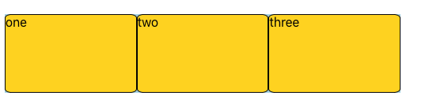

# flex 布局的应用

## 介绍

Flex 是 Flexible Box 的缩写，意为"弹性布局"，用来为盒状模型提供最大的灵活性（空间分布和对齐）。设为 Flex 布局以后，子元素的 float、clear 和 vertical-align 属性将失效。Flex 是一种一维布局，一个 flexbox 一次只能处理一个维度上的元素布局，一行或者一列。

## flexbox 的轴线

flexbox 有两根轴线：主轴和交叉轴。主轴由 ==flex-direction== 定义，交叉轴垂直于主轴  
flex-direction 可以取 4 个值：`flex-direction: row | row-reverse | column | column-reverse`

- `row | row-reverse`主轴沿 inline 方向延伸，交叉轴沿着列向下
- `column | column-reverse`主轴沿上下（block）方向，交叉轴水平方向

## flex 容器的初始值

所有 flex 元素都有如下属性

- 元素排列为一行
- 元素从主轴的起始线开始
- 元素不会在主维度的方向拉伸，但是可以缩小
- 元素被拉伸来填充交叉轴的大小
- flex-basis 属性为 auto
- flex-wrap 属性为 nowrap

### 实现换行效果

- ==flex-wrap==实现多行效果
  - nowrap 不换行
  - wrap 换行
  - wrap-reverse 第一行在下方

### 属性简写

==flex-flow==是`flex-direction` 和`flex-wrap`的缩写

## flex 元素的属性

在开发的时候经常用 flex 这个属性作用于弹性盒子的子元素，例如：`flex:1`或者`flex: 1 1 auto`，那么这个属性到底控制了元素怎么的行为呢？`flex:1`又究竟是什么含义呢？让这篇文章带你彻底了解 flex 属性吧！
首先我们需要了解，flex 是三个属性 `flex-grow` 、`flex-shrink` 、`flex-basis`的简写，可以使用一个、两个、或者三个值指定 flex 属性。具体语法可以参考[MDN-flex](https://developer.mozilla.org/zh-CN/docs/Web/CSS/flex)
接下来我们逐一解释这三个属性对元素的影响

- ==flex-basis== 定义了空间分配发生之前初始化 flex 子元素的尺寸，属性默认值 auto； flex 子元素未伸张和收缩之前，它的大小是多少。
  如果 flex-basis 设置为 auto , 浏览器会先检查 flex 子元素的主尺寸是否设置了 flex 子元素的初始值。比如说你已经给你的 flex 子元素设置了 150px 的宽，则 150px 就是这个 flex 子元素的 flex-basis；如果没有设置，则 auto 会解析为其内容的大小。

```css
:first-child {
  width: 150px;
}
```

效果如下：

如果你想 flexbox 完全忽略 flex 子元素的尺寸就设置 flex-basis 为 0。


在介绍下面两个属性前先看两个概念 `positive free space` 正向自由空间和 `negative free space`反向自由空间:

- 正向自由空间
  比如说，现在有 500px 宽的 flex 容器，flex-direction 属性值为 row, 三个 100px 宽的 flex 子元素， 那么剩余的 200px 的 就是正向自由空间(positive free space)。
- 反向自由空间
  当子元素的宽度总和大于容器宽度时，溢出的尺寸就是反向自由空间。
  

那么用什么属性分配正负自由空间呢？

- ==flex-grow== 默认值 0，若被赋值为一个正整数， flex 元素会以 flex-basis 为基础，沿主轴方向增长尺寸，并占据可用空间。flex-grow 按比例分配增长空间。

初始状态：我们给三个元素都设定宽度，并且总和不大于主轴宽度

```less
.flex-grow-father {
  width: 500px;
  div:nth-child(1) {
    width: 50px;
  }
  div:nth-child(2) {
    width: 100px;
  }
  div:nth-child(3) {
    width: 150px;
  }
}
```


增加的宽度计算：假设元素的 flex-grow 值为 x，则宽度=`(x/x的总合)*length`；元素最终宽度等于 `flex-basis 值+增加的宽度`；
相同宽度增长：当给每个子元素的都设定相同的 flex-grow 值，每个元素就会增长相同的宽度

```less
.with-same-flex-grow {
  * {
    flex-grow: 1;
  }
}
```


本例中第一个元素宽度的计算`(1/(1+1+1)*200)+50 = 116.67 px`
不同宽度增长

```less
.with-different-flex-grow {
  div:nth-child(1) {
    flex-grow: 2;
  }
  div:nth-child(2) {
    flex-grow: 1;
  }
  div:nth-child(3) {
    flex-grow: 1;
  }
}
```


本例中第一个元素宽度的计算`(2/(2+1+1)*200)+50 = 150 px`
想让开始时尺寸不同的元素内容大小相等，可以将 flex-basis 设置为 0（完全忽略 flex 子元素的尺寸） flex-grow 为 1（等比例分配）

```css
.average {
  * {
    /* flex: 1 1 0; */
    flex-basis: 0;
    flex-grow: 1;
  }
}
```



- ==flex-shrink== 属性指定了 flex 元素的缩小值, 它确定在分配 negative free space 时，flex 子元素相对于 flex 容器中其余 flex 子元素收缩的程度。默认值 1。用于减少盒子空间使盒子适应容器而不溢出(为了避免 border 干扰去掉边框)

初始状态，我们给三个元素都设定宽度，并且总和大于主轴宽度

```less
.flex-shrink-wrapper {
  display: flex;
  div:nth-child(1) {
    width: 100px;
    background: gold;
  }
  div:nth-child(2) {
    width: 200px;
    background: tan;
  }
  div:nth-child(3) {
    width: 300px;
    background: gold;
  }
}
.zero {
  * {
    flex-shrink: 0;
  }
}
```


吸收的宽度计算：假设每个 flex-shrink 的值为 x<sub>n</sub>，元素的初始宽度为 l<sub>n</sub>，那么每个元素吸收的宽度为：(x<sub>i</sub>\*l<sub>i</sub>)/(x<sub>1</sub>*l<sub>1</sub> +...+ x<sub>n</sub>*l<sub>n</sub>)
相同的 flex-shrink 值

```less
.with-same-flex-shrink {
  * {
    flex-shrink: 1;
  }
}
```


这时第一个元素的吸收宽度为：`1*100/(1*100+1*200+1*300)*100=16.67`，最终元素宽度为 100-16.67=83.37px
这时第一个元素的吸收宽度为：`1*200/(1*100+1*200+1*300)*100=33.33`，最终元素宽度为 200-33.33=166.67px
这时第一个元素的吸收宽度为：`1*30000/(1*100+1*200+1*300)*100=50`，最终元素宽度为 300-50=250px
不同的 flex-shrink 值

```less
.with-different-flex-shrink {
  div:nth-child(1) {
    flex-shrink: 1;
  }
  div:nth-child(2) {
    flex-shrink: 2;
  }
  div:nth-child(3) {
    flex-shrink: 0;
  }
}
```


这时第一个元素的吸收宽度为：`1*100/(1*100+2*200)*100=20`，最终元素宽度为 100-20=80px
这时第二个元素的吸收宽度为：`2*200/(1*100+2*200)*100=80`，最终元素宽度为 200-80=120px
这时第三个元素的 flex-shrink 值为 0，不吸收宽度，最终元素宽度即为元素本身的宽度 300px

```less
.two-grid-wrapper {
  display: flex;
  margin-top: 20px;
  height: 200px;
  .left {
    width: 200px;
    background-color: gold;
  }
  .right {
    flex: 1;
    background-color: tan;
  }
}
.three-grid-wrapper {
  display: flex;
  margin-top: 20px;
  height: 200px;
  .left {
    width: 200px;
    background-color: gold;
  }
  .right {
    width: 200px;
    background-color: gold;
  }
  .center {
    flex: 1;
    background-color: tan;
  }
}
```

### flex 预定的简写值

- flex: initial 的扩展为 0 1 auto
- flex: auto 的扩展为 1 1 auto
- flex: none 的扩展为 0 0 auto
- flex: `<positive-number>`的扩展为 `<positive-number> 1 0`

ps.flex 子元素没有正向自由空间 positive free space 就不会增长，没有反向自由空间 negative free space 就不会缩小。

## 元素间的对齐和空间分配

Flexbox 的一个关键特性是能够设置 flex 元素沿主轴方向和交叉轴方向的对齐方式，以及它们之间的空间分配。

- ==align-items== 属性可以使元素在交叉轴方向对齐。
  - stretch
  - flex-start
  - flex-end
  - center
- ==justify-content==属性用来使元素在主轴方向上对齐
  - stretch
  - flex-start
  - flex-end
  - center
  - space-around
  - space-between
