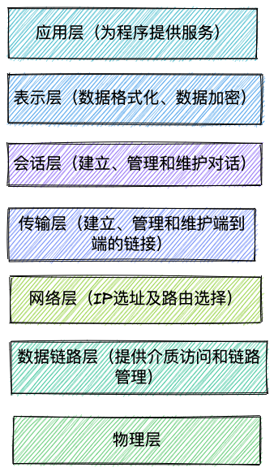
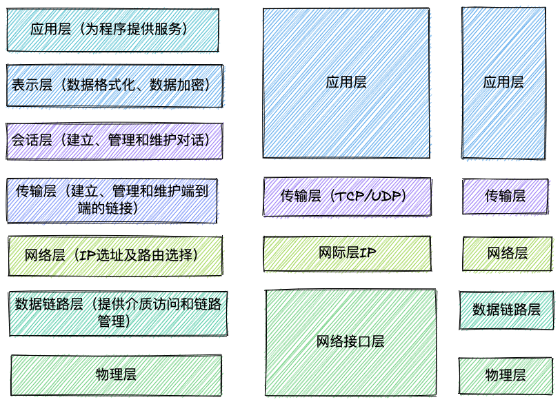

# HTTP 状态码

## 常见的状态码

| 类别 | 原因                            | 描述               |
| ---- | ------------------------------- | ------------------ |
| 1xx  | Informational(信息性状态码)     | 接受的请求正在处理 |
| 2xx  | success                         | 请求正常处理完成   |
| 3xx  | 重定向                          | 需要一些附加操作   |
| 4xx  | Client Error (客户端错误状态码) | 服务器无法处理请求 |
| 5xx  | Server Error(服务器错误状态码)  | 服务器处理请求出错 |

## 同样是重定向 307 303 302 的区别

302 是 http1.0 的协议状态码，在 http1.1 版本的时候为了细化 302 状态码⼜出来了两个 303 和 307。 303 明确表示客户端应当采⽤ get ⽅法获取资源，他会把 POST 请求变为 GET 请求进⾏重定向。 307 会遵照浏览器标准，不会从 post 变为 get。

# DNS

## DNS 协议是什么

- **概念**：DNS 是域名系统（Domain Name System)的缩写，提供的是一种主机名到 IP 地址的转换服务，就是我们常说的域名系统。它是一个由分层的 DNS 服务器组成的分布式数据库，是定义了主机如何查询这个分布式数据库的方式的应用层协议。能够使人更方便的访问互联网，而不用去记住能够被机器直接读取的 IP 数串。

- **作用**：将域名解析为 IP 地址，客户端向 DNS 服务器（DNS 服务器有自己 IP 地址）发送域名查询请求，DNS 服务器告知客户机 Web 服务器的 IP 地址。

## DNS 同时使用 TCP 和 UDP 协议

## DNS 完整的查询过程

## 迭代查询和递归查询

## DNS 记录和推文

# 网络模型

## OSI 七层模型



- 应用层
  - OSI 模型中最靠近用户的一层，为计算机用户提供应用接口，也为用户直接提供各种网络服务；
    - 客户端与服务端经常会有的数据请求：`http https`
    - 文件传输协议：`FTP` 一些资源网站可能会用到：百度网盘、迅雷
    - 邮件传输协议：`SMTP`
- 表示层
  - 表示层提供各种用于应用层数据的编码功能和转换功能，确保一个系统的应用层发送的数据能被另一个系统的应用层识别。如果必要，该层可提供一种标准表示形式，用于将计算机内部的各种数据格式转换成通信中采用的标准表示形式。数据压缩和数据加密也是表示层可提供的转换功能之一。在项目开发中，为了方便数据传输，可以使用 base64 对数据进行编解码。如果按功能来划分，base64 应该是工作在表示层。
- 会话层
  - 会话层就是负责建立、管理和终止表示层实体之间的通信会话。该层的通信由不同设备中的应用程序之间的服务请求和响应组成。
- 传输层
  - 传输层建立了主机端到端的链接，传输层的作用是为上层协议提供端到端的可靠和透明的数据传输服务，包括处理差错控制和流量控制等问题。我们通常说的 TCP、UDP 就是在这一层，端口号就是这里说的“端”。
- 网络层
  - 本层通过 IP 寻址来建立两个节点之间的连接，为源端的运输层送来的分组，选择合适的路由和交换节点，正确无误地按照地址传送给目的端的运输层。就是通常说的 IP 协议层。我们可以这样理解，网络层规定了数据包的传输路线，而传输层则规定了数据包的传输方式。
- 数据链路层
  - 将比特组合成字节，再将字节组合成帧，使用链路层地址（以太网使用 MAC 地址）来访问介质，并进行差错检测。网络层是规划了数据包的传输路线，而数据链路层就是传输路线。不过，在数据链路层上还增加了差错控制的功能。
- 物理层
  - 实际最终信号的传输是通过物理层实现的。通过物理介质传输比特流。规定了电平、速度和电缆针脚。常用设备有（各种物理设备）集线器、中继器、调制解调器、网线、双绞线、同轴电缆。这些都是物理层的传输介质。

**OSI 七层模型特点：对等通信**对等通信，为了使数据分组从源传送到目的地，源端 OSI 模型的每一层都必须与目的端的对等层进行通信，这种通信方式称为对等层通信。在每一层通信过程中，使用本层自己协议进行通信。

## TCP/IP 五层协议



- 应用层
  - 直接为进程提供服务；应用层协议定义的是应用进程间通讯和交互的规则，不同的应用有着不同的应用层协议；
  - **协议:** HTTP Telnet FTP TFTP DNS SMTP
- 传输层（运输层）
  - 为两台主机中的进程提供通信服务。主要有两种协议`TCP`和`UDP`
  - **设备:** 四层交换机、四层的路由器
  - **协议:** TCP UDP
- 网络层（网际层）
  - 为两台主机提供通信服务，并通过选择合适的路由将数据传递到目标主机
  - **设备:** 路由器、三层交换机
  - **协议:** IP ICMP RIP IGMP
- 数据链路层
  - 负责将网络层交下来的 IP 数据报封装成帧，并在链路的两个相邻节点间传送帧，每一帧都包含数据和必要的控制信息（如同步信息、地址信息、差错控制等）。
  - **设备:** 网桥、以太网交换机、网卡
  - **协议:** ARP
- 物理层
  - 确保数据可以在各种物理媒介上进行传输，为数据的传输提供可靠的环境
  - **设备:** 中继器、集线器、双绞线
  - **协议:**

TCP/IP 五层协议也是对等通信

# TCP 和 UDP

## TCP 和 UDP 的概念和特点

- TCP：全称传输控制协议。是一种`面向连接的、可靠的、基于字节流的传输层通信协议`
  - 面向连接：发送数据之前必须在两端建立连接。建立的连接方法是“三次握手”，这样能建立可靠的连接。
  - 仅支持单播传播：每条 TCP 传输只能有两个端点，只能进行点对点的传播，不支持多播和广播。
  - 面向字节流：不保留报文边界的情况下以字节流的方式进行传输。
  - 可靠传输：对于可靠传输，判断丢包、误码靠的是 TCP 的段编号以及确认号。TCP 为了保证报文传输的可靠，就给每个包一个序号，同时序号也保证了传送到接收端实体的包的按序接收。然后接收端实体对已成功收到的字节发回一个相应的确认(ACK)；如果发送端实体在合理的往返时延(RTT)内未收到确认，那么对应的数据（假设丢失了）将会被重传。
  - 提供拥塞控制：当网络出现拥塞的时候，TCP 能够减小向网络注入数据的速率和数量，缓解拥塞
  - 提供全双工通信：TCP 允许通信双方的应用程序在任何时候都能发送数据，因为 TCP 连接的两端都设有缓存，用来临时存放双向通信的数据。当然，TCP 可以立即发送一个数据段，也可以缓存一段时间以便一次发送更多的数据段（最大的数据段大小取决于 MSS）
- UDP：全称用户数据报协议。是一种`无连接的通信协议`
  - 面向无连接：发送前不需要建立连接，也不会对数据进行拆分和拼接操作
    - 在发送端，应用层将数据传递给传输层的 UDP 协议，UDP 只会给数据增加一个 UDP 头标识下是 UDP 协议，然后就传递给网络层了
    - 在接收端，网络层将数据传递给传输层，UDP 只去除 IP 报文头就传递给应用层，不会任何拼接操作
  - 有单播、多播、广播的功能：UDP 不止支持一对一的传输方式，同样支持一对多，多对多，多对一的方式；
  - 面向报文：发送方的 UDP 对应用程序交下来的报文，在添加首部后就向下交付 IP 层。UDP 对应用层交下来的报文，既不合并，也不拆分，而是保留这些报文的边界。因此，应用程序必须选择合适大小的报文
  - 不可靠性：首先体现在通信不需要连接；其次体现在 UDP 协议收到什么什么数据就传递什么数据，并且不会备份数据，发送数据也不关心接收方是否已经正确接收到数据了；最后，UDP 没有拥塞控制，一直以恒定的速度发送数据。即使网络条件不好，也不会对发送速率进行调整。这样实现的弊端就是在网络条件不好的情况下可能会导致丢包，但是优点也很明显，在某些实时性要求高的场景（比如电话会议）就需要使用 UDP 而不是 TCP。
  - 头部开销小，传输数据报文时效性很高效。UDP 的头部开销小，只有 8 字节，相比 TCP 的至少 20 字节（最大 60 字节）要少得多，在传输数据报文时是很高效的。
    - 两个十六位的端口号，分别为源端口（可选字段）和目标端口
    - 整个数据报文的长度
    - 整个数据报文的检验和（IPv4 可选字段），该字段用于发现头部信息和数据中的错误

## TCP 和 UDP 的区别

##  TCP 和 UDP 的使用场景

## UDP 协议为什么不可靠

## TCP 的重传机制

## TCP 的流量控制机制

## TCP 的可靠传输机制

## TCP 的三次握手协议和四次挥手

## TCP 粘包是什么？如何处理

## 为什么 UDP 不回粘包

# Websocket

## 对 websocket 的理解

## 短轮询、长轮询、sse 和 websocket 间的区别

# HTTPS

## 什么是 HTTPS 协议

- HTTPS 是超文本传输安全协议（Hypertext transfer Protocol Secure）的简称，是一种通过计算机网络进行安全通信的传输协议。HTTPS 经由 HTTP 进行通信，利用 SSL/TLS 来加密数据包。
- HTTP 协议采用明文传输信息，存在信息窃听、信息篡改和信息劫持的风险，而协议 TLS/SSL 具有身份验证、信息加密和完整性校验的功能，可以避免此类问题发生。安全层的主要职责就是对发起的 HTTP 请求的数据进行加密操作 和 对接收到的 HTTP 的内容进行解密操作。

## TLS/SSL 的工作原理

- TLS/SSL 全称安全传输层协议（Transport Layer Security）, 是介于 TCP 和 HTTP 之间的一层安全协议，不影响原有的 TCP 协议和 HTTP 协议，所以使用 HTTPS 基本上不需要对 HTTP 页面进行太多的改造。

## 数字证书是什么

## HTTPS 通信（握手）过程

## HTTPS 是怎么保证安全的

# HTTP

## GET 和 POST 请求的区别

- **应用场景：** GET 请求是一个幂等的请求，一般 Get 请求用于对服务器资源不会产生影响的场景，比如说请求一个网页的资源。而 Post 不是一个幂等的请求，一般用于对服务器资源会产生影响的情景，比如注册用户这一类的操作。
- **是否缓存：** 浏览器一般会对 Get 请求缓存，但很少对 Post 请求缓存。
- **发送的报文格式：** Get 请求的报文中实体部分为空，Post 请求的报文中实体部分一般为向服务器发送的数据。
- **安全性：** Get 请求可以将请求的参数放入 url 中向服务器发送，这样的做法相对于 Post 请求来说是不太安全的，因为请求的 url 会被保留在历史记录中。
- **请求长度：** 浏览器由于对 url 长度的限制，所以会影响 get 请求发送数据时的长度。这个限制是浏览器规定的，并不是 RFC 规定的。
- **参数类型：** post 的参数传递支持更多的数据类型。

## POST 和 PUT 请求的区别

## 常见的 HTTP 请求头和响应头

## HTTP 状态码 304

## 常见的 HTTP 请求方法

- GET: 向服务器获取数据；
- POST：将实体提交到指定的资源，通常会造成服务器资源的修改；
- PUT：上传文件，更新数据；
- DELETE：删除服务器上的对象；
- HEAD：获取报文首部，与 GET 相比，不返回报文主体部分；
- OPTIONS：询问支持的请求方法，用来跨域请求；
- CONNECT：要求在与代理服务器通信时建立隧道，使用隧道进行 TCP 通信；
- TRACE: 回显服务器收到的请求，主要⽤于测试或诊断。

## OPTIONS 请求方法及使用常见

## HTTP1.0 和 HTTP1.1 之间有哪些区别

## HTTP1.1 和 HTTP2.0 的区别

## HTTP 和 HTTPS 的区别

- HTTPS 协议需要 CA 证书，费用较高；而 HTTP 协议不需要；
- HTTP 协议是超文本传输协议，信息是明文传输的，HTTPS 则是具有安全性的 SSL 加密传输协议；
- 使用不同的连接方式，端口也不同，HTTP 协议端口是 80，HTTPS 协议端口是 443；
- HTTP 协议连接很简单，是无状态的；HTTPS 协议是有 SSL 和 HTTP 协议构建的可进行加密传输、身份认证的网络协议，比 HTTP 更加安全。

## GET 方法 URL 长度限制的原因

实际上 HTTP 协议规范并没有对 get 方法请求的 url 长度进行限制，这个限制是特定的浏览器及服务器对它的限制。
IE 对 URL 长度的限制是 2083 字节(2K+35)。由于 IE 浏览器对 URL 长度的允许值是最小的，所以开发过程中，只要 URL 不超过 2083 字节，那么在所有浏览器中工作都不会有问题。

```
GET的长度值 = URL（2083）- （你的Domain+Path）-2（2是get请求中?=两个字符的长度）
```

## 当在浏览器中输入网址并按下回车之后发生了什么

## 对 keep-alive 的理解

## 页面有多张图片，HTTP 是怎么的加载表现

## HTTP 请求报文是什么样的

- 一个 HTTP 请求报文由`请求行`、`请求头部`、`空行`和`请求数据`构成
- `请求行`由三部分组成：请求方法、请求 URL(不包括域名)、HTTP 协议版本
- `请求头部`由关键字/值对组成，每行一对；常见请求头如下：
  - user-agent
  - content-type
- `空行`请求头之后是一个空行，通知服务器以下不再有请求头
- `请求体` post 才有，get 没有。与请求数据相关的最常使用的请求头是 Content-Type 和 Content-Length 。

## HTTP 响应报文是什么样的

- `状态行`，`首部行`，`空行`,`实体`
- 状态行由三部分组成: `服务器 HTTP 协议版本`，`响应状态码`，`状态码的文本描述`
  - 状态码：
    - 1xx：指示信息--表示请求已接收，继续处理。
    - 2xx：成功--表示请求已被成功接收、理解、接受。
    - 3xx：重定向--要完成请求必须进行更进一步的操作。
    - 4xx：客户端错误--请求有语法错误或请求无法实现。
    - 5xx：服务器端错误--服务器未能实现合法的请求。
- 响应首部
- 响应实体

## HTTP 协议的优点和缺点

## 说一下 HTTP3.0

## HTTP 协议的性能

## URL 有哪些组成部分
